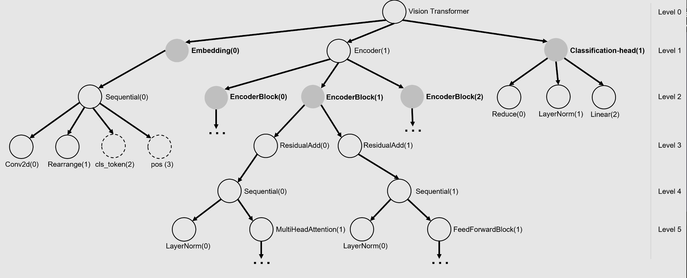

# Understanding Adversarial Robustness of ViT via Cauchy Problem 

In this repository we release models from the papers

- [Understanding Adversarial Robustness of Vision Transformers via Cauchy Problem](https://arxiv.org/abs/2208.00906)

At a high level, it has been proved that the intermediate feature of the neural network model with residual addition structure, e.g., ResNet, ViT, can be approximated by the solution of its underlying ODE, the blue and yellow dash line in the figure above Therefore the difference between the original and perturbed input image can be approximated by the difference in the solution of their corresponding ODEs, which is dominated by the maximum singular value of the Jacobian matrix of each basic block w.r.t. their inputs. To investigate the adversarial robustness of ViTs, this code is to

- 1. **For a given network, it decomposes the model as a sum of individual modules in a hierarchical way**
- 2. **It computes the maximal singular value for the Jacobian Matrix for each decomposed module**

# Module Explain 
There are 3 separate modules included: build_model, attack_model, analyze_model. The infomation about each module is:    

- **build_model**: all the functions and class to train a neural network from sketch, include optimizer, data and models that defined. Notice that the taining epachs is given by a interval of (start_epoch, end_epoch), and if the start_epoch is not 1, it has to be some trained network that end at that epoch, and it will load the network, continue training. The buid_model module also include validation. 
- **attack_model**: this module is designed for Integration of different attacking methods, e.g., FGSM, PGD, CW, AA. a part of dataset will be attacked and attacking results will also be generated and stored in the folder adv_examples. Robust accuracy, loss and the distance of original and perturbed input images will also be calculated and store in the log folder. 
- **analysis**: this is the main part of the model, it will first decompose the input model into pre-defined sub-modules, and for each module, the Maximum Singluar Value of the Jacobian of each module w.r.t. their inputs will be estimated. For small model with small embedding size the exact value can be computed, but for large models, an upper bound is calculated to approximate the original one.    

# How to use the code
The sequence of the <code>.py</code> file is first to call <code>build.py</code> to build and validate the model; then <code>attack.py</code> can be used to attack the given trained model; <code>analyze.py</code> is the final step to give the **Maximum Singlar Value** of the **Jacobian** of each decomposed moduel w.r.t. their inputs. Note that for both attack and analyze models, you have to bulid model first, but there is no requirement for attacking and analyzing which one should be the first, they are independent modules. 

# Key features 

As shown in the figure, the neural network is decomposed and stored recursively in a tree, and each tree level represents the neural network in the given details. Most of the time, we need different detail for the different modules. Hence our code could render neural networks in arbitrary details, given predefined decomposing steps. The solid nodes in figure above show that the ViT can be decomposed as a Patch Embedding block, a sequence of Encoder Blocks and the Classification Head. The dash array in the figure is the operation done without <code>nn.Module</code> in <code>PyTorch</code>. Since our tree is created by recursively calling <code>.children</code> method for the network, any operation that is done without including <code>nn.Module</code> cannot be shown on the tree. A check-out for the model is suggested.

# Limitation 

Currently, our software only supports neural network modules defined in <code>PyTorch</code>. The future version will support a more flexible way of neural network definitions. For singular value computation, the <code>PyTorch</code> built-in method is used. The problem is that this build-in method only works for the neural network with a small dimension of intermediate features. The computation will run out of computational resources for more advanced large models. Our current version only provides an alternative approximation method that yields the upper bound for the maximum singular value. A more efficient method will be considered in the future.

-- Zheng Wang & Wenjie Ruan
